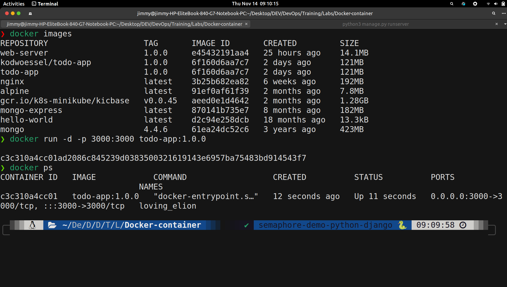
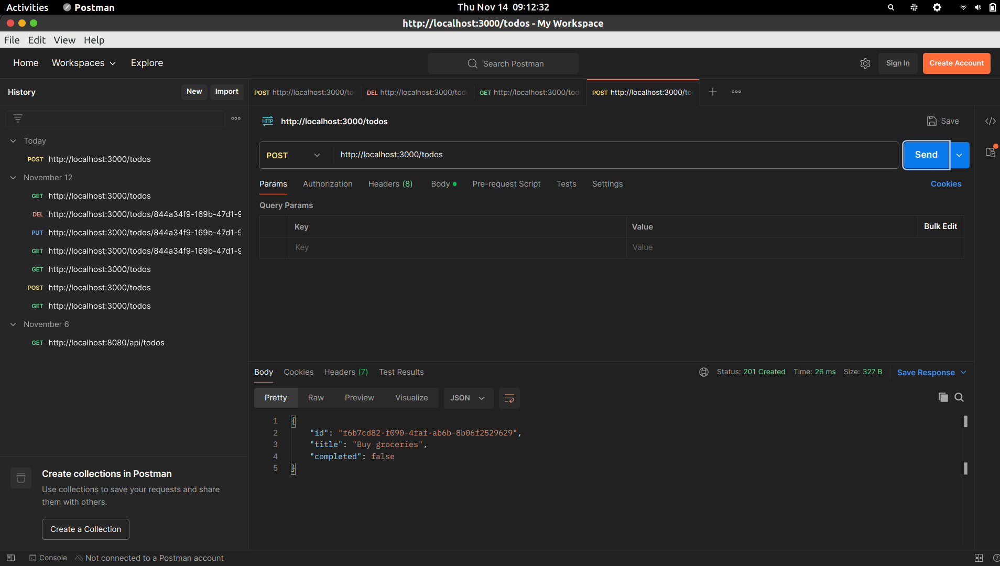
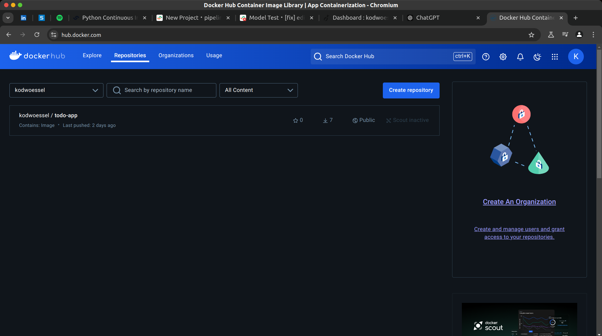

# Lab Documentation: Building and Deploying a Web Server with Docker

This document outlines the steps undertaken to create a Node.js-based web server, build a Docker image for it, run the image as a container, and push the tagged image to Docker Hub.

---

## Lab Objectives

1. **Develop a web server** in a language and framework of choice.
2. **Build a Docker image** for the web server using a `Dockerfile`.
3. **Run the image as a container** and verify its functionality.
4. **Tag the image** and push it to Docker Hub.
5. **Test the running container** to confirm the application is operational.

---

## Web Server Development

For this lab, a simple **To-Do List API** was created using Node.js and Express.

### Web Server Code

```javascript
const express = require('express');
const bodyParser = require('body-parser');
const { v4: uuidv4 } = require('uuid');

const app = express();
app.use(bodyParser.json());

const PORT = 3000;

// In-memory storage for the to-do items
let todos = [];

// GET all to-dos
app.get('/todos', (req, res) => {
  res.json(todos);
});

// GET a single to-do by ID
app.get('/todos/:id', (req, res) => {
  const todo = todos.find(t => t.id === req.params.id);
  if (!todo) {
    return res.status(404).json({ message: 'To-do not found' });
  }
  res.json(todo);
});

// POST a new to-do
app.post('/todos', (req, res) => {
  const { title } = req.body;
  if (!title) {
    return res.status(400).json({ message: 'Title is required' });
  }
  const newTodo = { id: uuidv4(), title, completed: false };
  todos.push(newTodo);
  res.status(201).json(newTodo);
});

// PUT (update) a to-do by ID
app.put('/todos/:id', (req, res) => {
  const todo = todos.find(t => t.id === req.params.id);
  if (!todo) {
    return res.status(404).json({ message: 'To-do not found' });
  }
  const { title, completed } = req.body;
  if (title !== undefined) todo.title = title;
  if (completed !== undefined) todo.completed = completed;
  res.json(todo);
});

// DELETE a to-do by ID
app.delete('/todos/:id', (req, res) => {
  const index = todos.findIndex(t => t.id === req.params.id);
  if (index === -1) {
    return res.status(404).json({ message: 'To-do not found' });
  }
  todos.splice(index, 1);
  res.status(204).send();
});

app.listen(PORT, () => {
  console.log(`Server is running on http://localhost:${PORT}`);
});
```

---

## Dockerization

A multistage `Dockerfile` was used to optimize the image size and manage dependencies efficiently.

### Dockerfile

```dockerfile
# Stage 1: Build Stage
FROM node:16-alpine AS build

WORKDIR /app

COPY package*.json ./

RUN npm install

COPY . .

# Stage 2: Production Stage
FROM node:16-alpine

WORKDIR /app

COPY --from=build /app /app

RUN npm install --production

EXPOSE 3000

CMD ["node", "server.js"]
```

### Build and Run Commands

1. **Build the Docker Image**  
   ```bash
   docker build -t todolist-app:1.0 .
   ```

2. **Run the Docker Container**  
   ```bash
   docker run -p 3000:3000 -d --name todolist-container todolist-app:1.0
   ```

### Screenshot: Docker Image and Running Container



---

## Testing the Application

The running container was tested using **Postman**. The API endpoints were verified for their functionality: 

- **GET /todos**: Retrieve all to-do items.  
- **POST /todos**: Create a new to-do.  
- **GET /todos/:id**: Retrieve a specific to-do by ID.  
- **PUT /todos/:id**: Update a to-do.  
- **DELETE /todos/:id**: Delete a to-do.  

### Screenshot: Testing with Postman



---

## Pushing to Docker Hub

1. **Tag the Image**  
   ```bash
   docker tag todolist-app:1.0 your-dockerhub-username/todolist-app:1.0
   ```

2. **Login to Docker Hub**  
   ```bash
   docker login
   ```

3. **Push the Image to Docker Hub**  
   ```bash
   docker push your-dockerhub-username/todolist-app:1.0
   ```

### Screenshot: Image on Docker Hub



---

## Additional Information

- **Running Container:** Refer to the Docker image and running container screenshot for details on the container and its status.
- **Testing Results:** See the Postman testing screenshot for confirmation of API functionality.
